# Online Bookstore - Documentation

## 1. Project Overview
The Online Bookstore is a fully functional web application built to allow users to browse, search, and buy books online. The system is designed to support customer accounts, secure shopping cart operations, an order checkout process, and a complete order history. Administrators can manage the book inventory, update stock, and view sales reports from a secured admin panel.

### System Goals
- Provide a clean, mobile-friendly shopping experience.
- Enable secure user registration, login, and session handling.
- Support book search by title, author, and genre.
- Maintain a shopping cart that users can update before checkout.
- Save completed orders and allow users to view order history.
- Provide an admin interface for inventory and sales management.

### Scope
This project covers both front-end and back-end functionality for a bookstore application. It includes:
- user authentication and profile management,
- a responsive book catalog,
- search and filtering features,
- book detail pages,
- a shopping cart and checkout workflow,
- order persistence and order history,
- an admin dashboard with CRUD operations, reports, and order status management.

## 2. Database Schema (ERD)
The application uses a MySQL database with the following tables and relationships:

### Tables
- `users`
  - `id` INT AUTO_INCREMENT PRIMARY KEY
  - `username` VARCHAR(50) UNIQUE NOT NULL
  - `email` VARCHAR(100) UNIQUE NOT NULL
  - `password` VARCHAR(255) NOT NULL
  - `role` ENUM('user', 'admin') DEFAULT 'user'
  - `created_at` TIMESTAMP DEFAULT CURRENT_TIMESTAMP

- `books`
  - `id` INT AUTO_INCREMENT PRIMARY KEY
  - `title` VARCHAR(255) NOT NULL
  - `author` VARCHAR(255) NOT NULL
  - `description` TEXT
  - `publisher` VARCHAR(255)
  - `price` INT NOT NULL
  - `genre` VARCHAR(100)
  - `image_url` VARCHAR(255)
  - `stock` INT DEFAULT 0
  - `created_at` TIMESTAMP DEFAULT CURRENT_TIMESTAMP

- `cart`
  - `id` INT AUTO_INCREMENT PRIMARY KEY
  - `user_id` INT NOT NULL
  - `book_id` INT NOT NULL
  - `quantity` INT DEFAULT 1
  - `UNIQUE KEY user_book (user_id, book_id)`

- `orders`
  - `id` INT AUTO_INCREMENT PRIMARY KEY
  - `user_id` INT NOT NULL
  - `total_price` INT NOT NULL
  - `shipping_address` TEXT NOT NULL
  - `payment_method` VARCHAR(50)
  - `payment_details` VARCHAR(100)
  - `status` ENUM('Pending', 'Processing', 'Shipped', 'Delivered') DEFAULT 'Pending'
  - `created_at` TIMESTAMP DEFAULT CURRENT_TIMESTAMP

- `order_items`
  - `id` INT AUTO_INCREMENT PRIMARY KEY
  - `order_id` INT NOT NULL
  - `book_id` INT NOT NULL
  - `quantity` INT NOT NULL
  - `price_at_purchase` INT NOT NULL

### Relationships
- `users.id` → `orders.user_id`
- `users.id` → `cart.user_id`
- `books.id` → `cart.book_id`
- `orders.id` → `order_items.order_id`
- `books.id` → `order_items.book_id`

### ERD
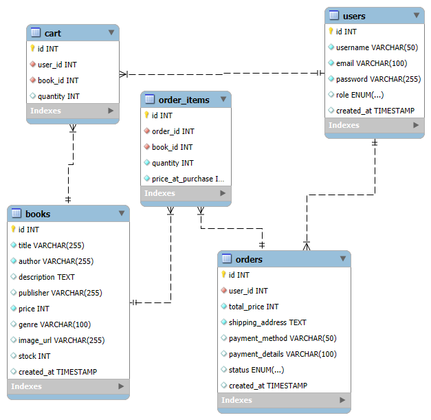

## 3. Architecture Description

### Backend Architecture
The backend is built in PHP and uses the `backend/` folder for server-side logic.

- `backend/config.php`
  - Creates a PDO connection to the MySQL database.
  - Configures secure session settings.
  - Sets the connection to throw exceptions for database errors.

- `backend/auth.php`
  - Handles user registration (`action=register`).
  - Handles login (`action=login`) with password hashing and session creation.
  - Handles logout (`action=logout`) and login state checking (`action=check`).
  - Returns JSON responses to the frontend.

- `backend/books.php`
  - Returns paginated book lists (`action=list`).
  - Supports searching by title, author, and genre.
  - Supports retrieving a specific book by ID.

- `backend/cart.php`
  - Adds books to cart (`action=add`).
  - Updates book quantities in cart (`action=update`).
  - Removes items from cart (`action=remove`).
  - Lists cart items (`action=list`).
  - Returns cart item count (`action=count`).
  - Protects cart operations behind user sessions.

- `backend/orders.php`
  - Creates orders from cart contents (`action=create`) with server-side validation.
  - Saves order items and updates book stock in a transaction.
  - Retrieves user order history (`action=list`).
  - Retrieves order details and invoices (`action=details`, `action=invoice`).

- `backend/admin.php`
  - Secures admin access with role-based checks.
  - Supports book CRUD operations: create, update, delete.
  - Supports updating order status.
  - Provides sales reports and dashboard statistics.

- Security features
  - Passwords hashed with `password_hash()`.
  - Prepared statements prevent SQL injection.
  - Sessions are regenerated on login and limited by lifetime.
  - Admin functionality is restricted by user role.

### Frontend Architecture
The frontend is a small multi-page application using standard HTML, Bootstrap, and one shared JavaScript file.

- `frontend/index.html`
  - Main catalog page with search and filters.

- `frontend/auth.html`
  - Login and registration page.

- `frontend/book.html`
  - Book detail page with Add to Cart button.

- `frontend/cart.html`
  - Shopping cart page with quantity update and remove options.

- `frontend/checkout.html`
  - Checkout form for shipping and payment details.

- `frontend/confirmation.html`
  - Order confirmation page.

- `frontend/profile.html`
  - User account/profile page.

- `frontend/orders.html`
  - Order history and past order list.

- `frontend/admin.html`
  - Admin panel for managing books and viewing sales.

- `frontend/invoice.html`
  - Invoice view for completed orders.

- `frontend/app.js`
  - Contains the shared application logic used by all pages.
  - Initializes page behavior by detecting page container IDs.
  - Manages authentication state and renders the navbar.
  - Implements dynamic alerts and client-side validation.
  - Communicates with backend PHP APIs using `fetch`.

- `frontend/style.css`
  - Adds custom styling alongside Bootstrap for branding and layout polish.

- Component structure
  - Navigation bar: dynamic user state, cart badge, admin link.
  - Catalog display: responsive book cards with cover, title, author, price.
  - Search/filter panel: title, author, and genre filters.
  - Book detail component: full description and Add to Cart action.
  - Cart component: item rows, quantity selectors, subtotal calculations.
  - Checkout component: shipping and payment inputs with inline validation.
  - Admin dashboard: inventory management and sales metrics.

## 4. Setup Instructions

### Local Environment
1. Install a local development server such as XAMPP, WAMP, or MAMP.
2. Copy the project folder into the web root directory: for example, `htdocs/advanced_web_dev`.
3. Start Apache and MySQL.
4. Open phpMyAdmin or MySQL client.
5. Create the database by importing `backend/database.sql`.
6. Edit `backend/config.php` and set the correct database host, username, and password.
7. Open the application in your browser at:
   - `http://localhost/advanced_web_dev/frontend/index.html`

### Server Environment
1. Upload the full project to your hosting server.
2. Ensure the web root points to the `frontend/` folder or that all frontend files are accessible.
3. Create a MySQL database on the server.
4. Import `backend/database.sql` into the server database.
5. Update `backend/config.php` with the server database credentials.
6. Set required file permissions for the web server user.
7. Use HTTPS in production and set `session.cookie_secure = 1` in `backend/config.php` if HTTPS is enabled.
8. Verify backend PHP files are accessible by frontend pages using their relative paths.

## 5. User Manual

### Customer Workflows

#### Register and Login
- Open `frontend/auth.html`.
- Toggle between Login and Register using the page buttons.
- Enter a username, password, and email when registering.
- After login, the navbar displays the username and a logout button.

#### Browse and Search Books
- Open `frontend/index.html`.
- Use the search filters:
  - Title search.
  - Author search.
  - Genre dropdown.
- Click the "Search Filter" button to apply filters.
- Reset filters with the "Reset Filters" button.

#### View Book Details
- Click the "View" button on any book card.
- The `frontend/book.html` page shows the full description, author, publisher, and price.
- Click "Add to Cart" to store the book in your cart.

#### Manage Cart
- Open `frontend/cart.html`.
- Review added items, adjust quantities, or remove books.
- The total updates automatically as quantities change.
- Proceed to checkout when ready.

#### Checkout and Order Confirmation
- Open `frontend/checkout.html`.
- Enter your shipping address and payment information.
- Submit the form to place the order.
- After a successful checkout, you are redirected to the confirmation page.

#### View Order History
- Open `frontend/orders.html`.
- See a chronological list of your past orders.
- Click order details or invoices if available.

### Administrator Workflows

#### Admin Login
- Log in with an administrator account.
- The navbar shows the "Admin Panel" link once logged in as admin.

#### Manage Books
- Open `frontend/admin.html`.
- Use the table or form to create new books.
- Edit existing book entries and update inventory stock.
- Delete books that are no longer available.

#### Sales Report and Order Status
- Use the admin report section to filter sales by title, customer, or date range.
- Update order statuses such as Pending, Processing, Shipped, and Delivered.
- Review dashboard statistics for total revenue, total orders, and best-selling books.

## 6. Annotated Screenshots and Placeholders

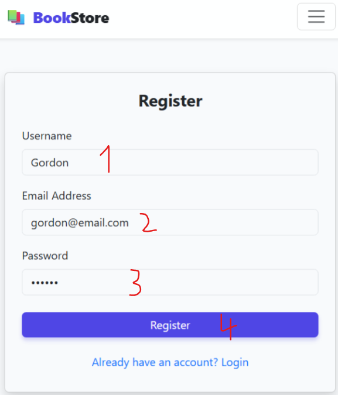
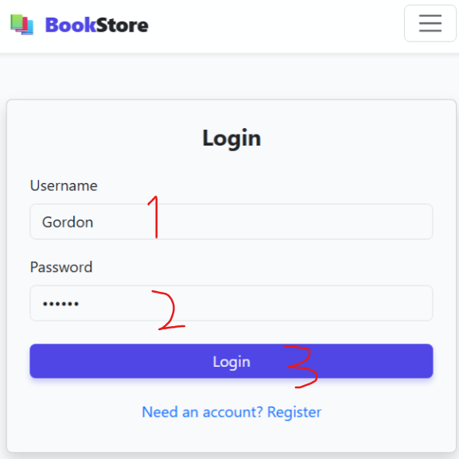
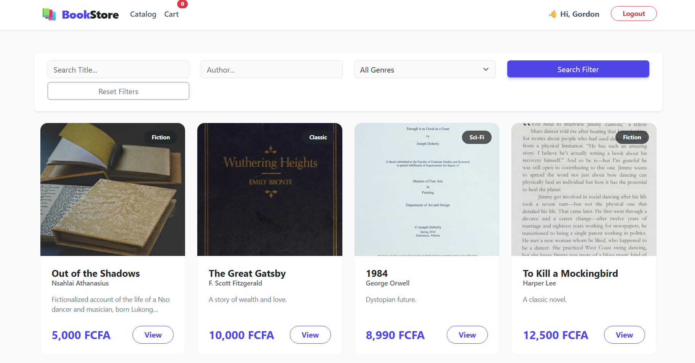
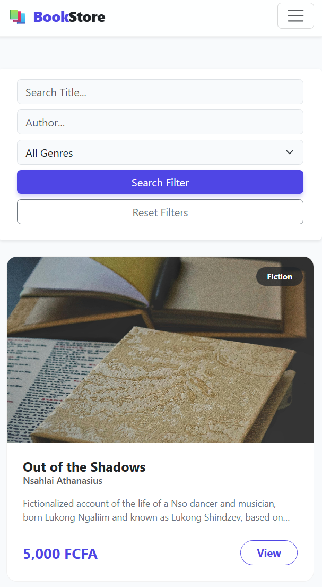

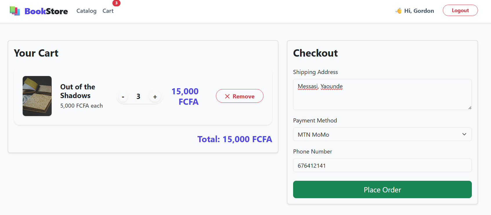
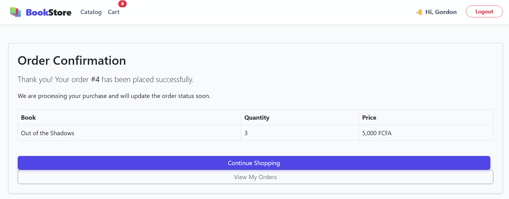
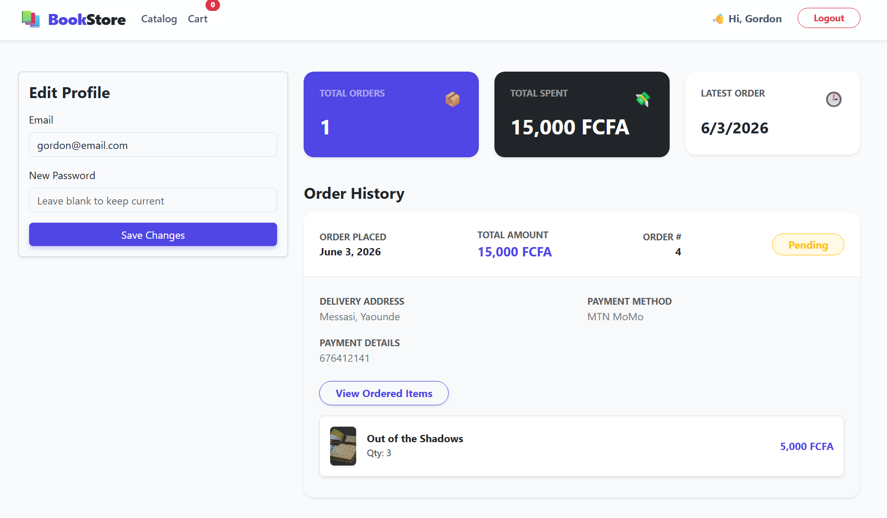
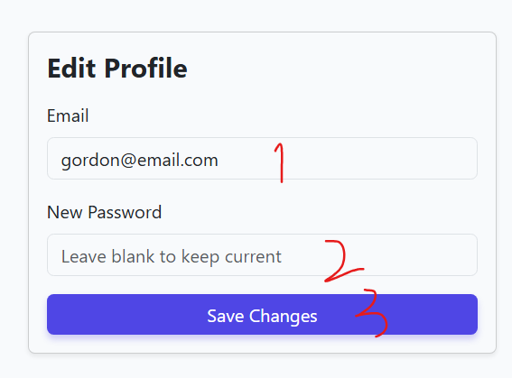
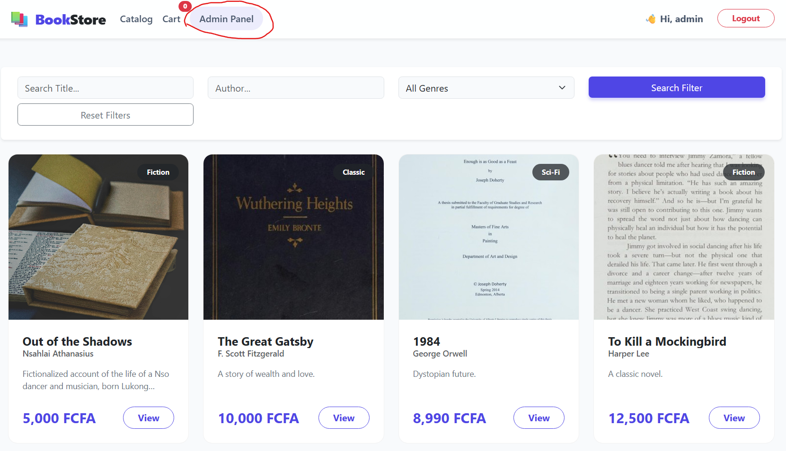

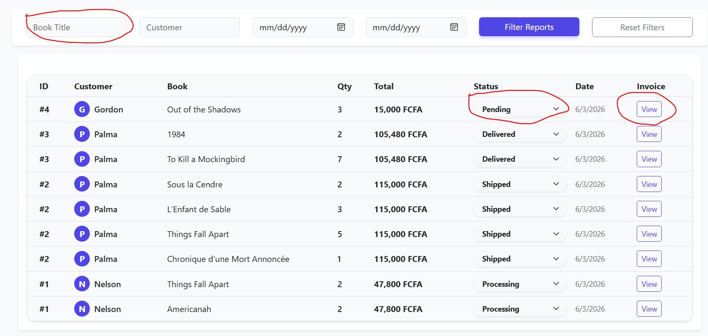
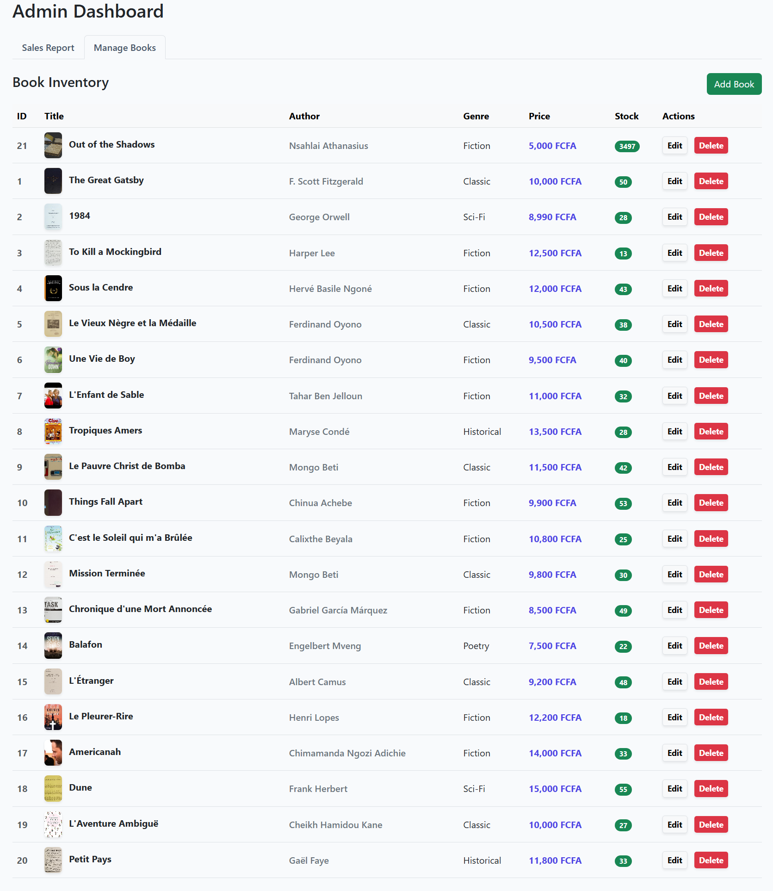
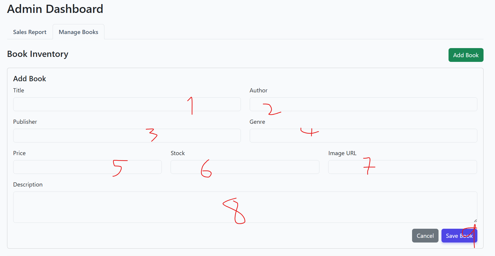
